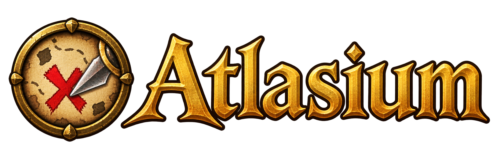

# Atlasium

  

A map add-on for World of Warcraft 3.3.5a (WotLK) that makes the world map feel like a modern web
map, and makes exploring with a group easier.

## Features

- **Smooth map navigation**: drag and zoom the world map the way you do in Google Maps.
- **Minimap wheel zoom**: zoom the minimap with the mouse wheel.
- **Minimap tiles**: draw unlit terrain at all six game zoom levels (experimental).
- **Native settings UI**: configure features in a Blizzard-style window or Interface Options,
  with a choice of English or Brazilian Portuguese.

## Planned Features
- **Map notes**: pin your own notes on the map.
- **TomTom integration**: set and follow waypoints with TomTom's arrow.
- **Questie integration**: see Questie's quests and objectives on the Atlasium map.
- **Party integration**: share waypoints, pings and notes with your group.

See [Features](docs/en-US/features.md) for details and current status.

## Documentation

Download the installable ZIP from [GitHub Releases](https://github.com/1mamute/atlasium/releases/latest).
Use the attached `Atlasium-v*.zip` file. GitHub's source archives include developer files.

Versions follow [Semantic Versioning](https://semver.org/).
New commits and pull request titles use `type: description`, without a scope.
See the [changelog](https://github.com/1mamute/atlasium/blob/main/CHANGELOG.md)
and [release guide](docs/en-US/contributing/releases.md).

**For players**

- [Installation](docs/en-US/installation.md): put Atlasium in your game.
- [Usage](docs/en-US/usage.md): slash commands and how to use the map.
- [Configuration](docs/en-US/configuration.md): settings and saved data.
- [Party integration](docs/en-US/party.md): share waypoints, pings and notes with your group.

**For contributors**

- [Contributing guide](docs/en-US/contributing/README.md): set up tools, understand the code, run tests.
- [Documentation publishing](docs/en-US/contributing/documentation.md): build and publish this documentation.

## Thanks

Atlasium draws on ideas from Carbonite, Questie, TomTom and Mapster. Thank you to their authors.
